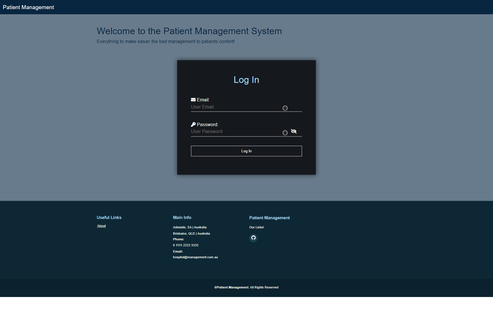
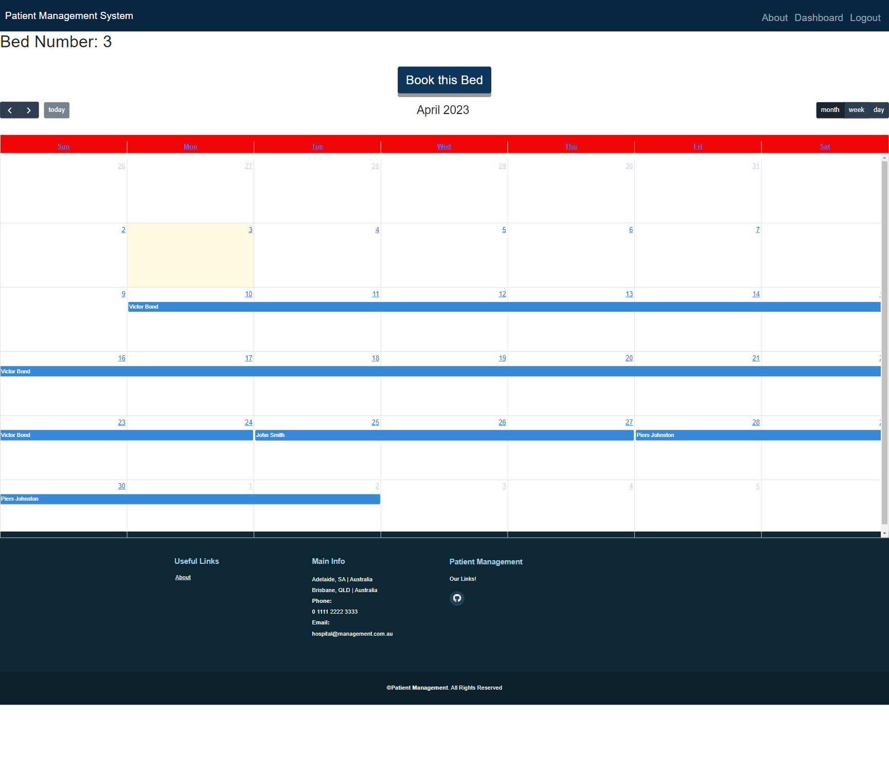
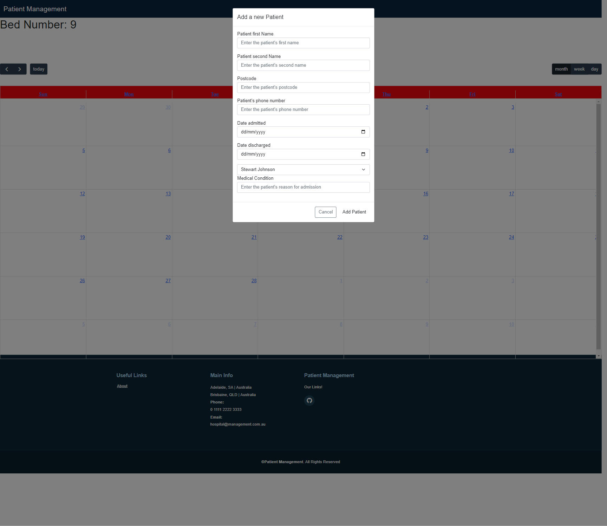

# Patient Management System

## Description
Patient management system that quickly identifies a bed that a patient could be admitted to and their information.

## Table of Contents
* [User Story](#user-story)
* [Usage](#usage)
* [Deployment](#deployment)
* [Screenshots](#screenshots)
* [License](#license)
* [Contributors](#contributors)

## User Story
- As a doctor I want to be able to log into a secure site where I can access patients’ information and be able to view what bed their admission details. 
- As a doctor I need to be able to view patient’s medical record that’s been hidden from other users. 
- As a staff I need to be able to log into a secure site and be able to admit a new patient to a bed as well.

## Usage
- When user launches the home page, user is redirected to login page if not logged in already.
- When log in page is launched, a form is displayed to enter email address and password to login.
- When user logs in, user is presented with a home page displaying all bed information with patient details.
- If no patient is allocated to a bed, no patient data is displayed.
- If logged in user is a doctor, user is able to see patient's medical condition.
- If logged in user is a medical staff, user is not able to see patient's medical condition.
- When user click on a bed, a calendar page for selected bed is displayed which also contains a booking button for the bed.
- User is able to navigate to different months to see past, current and future patient allocations for the bed.
- When use clicks on booking button, user is presented with a form where user can enter patient details, start date, expected discharge data, doctor name and medical condition.
- Patient information is added to the database and displayed on the calendar page.

## Deployment
Deployed webpage:https://hospitalmanagementsystem.herokuapp.com/

## Screenshots
Login Page

Home Page

Calendar Page

Add New Patient Form

## Contributors

Breno Ferreira Campos: https://github.com/Brenofc1

Daisy Chemasas: https://github.com/Chemasas

Darien Hallam: https://github.com/thorne7

Nilesh Patel: https://github.com/NileshPatel83

Timothy Van Mook-Letcher: https://github.com/TVML24

## License
The project is licensed under: MIT.
